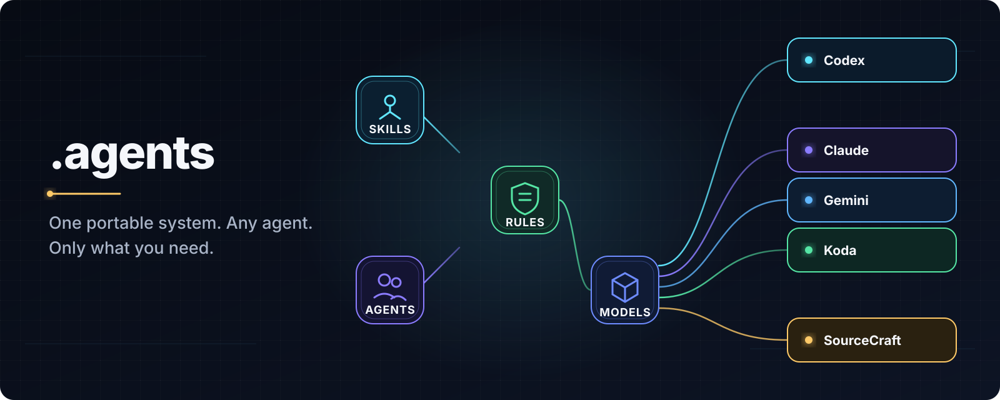

<p align="center"></p>

# .agents

<p align="center">
  <a href="https://github.com/bearatol/.agents/actions/workflows/test.yml"></a>
  <a href="LICENSE"></a>
</p>

<p align="center"><strong>用任何 AI 工具继续使用同一套规则、skills 和工作成果。</strong></p>

[Русский](README.md) · [English](README.en.md) · [简体中文](README.zh-CN.md)

`.agents` 是保存 AI 工作成果的共享工作空间。规则、skills、prompts、专业 agents 和其他资料都放在这里。它不是另一个模型，也不替代账号。更换电脑、账号或 AI 工具后，资料仍在你的 Git 仓库里。

## 为什么需要它

- 更换电脑、账号或 AI 工具时，工作成果仍然属于你；
- Claude、Codex、Gemini、Kimi 可以使用同一套规则和 skills；
- 一个 AI 执行，另一个 AI review，结果统一保存；
- 未来出现新类型时，只需增加新文件夹。

## 快速开始：三个步骤

需要 Git 和 Python 3。macOS、Linux 或 WSL：

```bash
git clone https://github.com/bearatol/.agents.git
cd .agents
./scripts/agents.sh setup
```

Windows：

```powershell
git clone https://github.com/bearatol/.agents.git
Set-Location .agents
.\scripts\agents.ps1 setup
```

安装会询问您希望 AI 帮您做什么，以及您使用哪个 AI 应用。可同时选择多个方向，也可用逗号输入多个 AI 应用。`generic` 只适用于没有专用适配器的工具。修改任何内容前会给出清晰确认。

安装完成后，先检查：

```bash
./scripts/agents.sh doctor
```

Windows：

```powershell
.\scripts\agents.ps1 doctor
```

`doctor` 会检查安装环境和连接。处理完冲突或已修改文件的提示后，重启所选 AI 工具，然后直接给出普通任务：

> 检查这个项目中的错误，修改后展示测试结果。

完成。日常使用不需要继续操作终端。

## 组合多个工作配置或全部安装

如果不想回答问题，可以直接写出需要的工作方向。例如，代码和视频：

```bash
./scripts/agents.sh setup --work code --work video --app codex
```

Windows：

```powershell
.\scripts\agents.ps1 setup -Work code,video -App codex
```

如需全部安装：

```bash
./scripts/agents.sh setup --work all --app codex
```

让多个 AI 应用同时使用同一工作空间：

```bash
./scripts/agents.sh setup --work all \
  --app codex --app claude --app gemini --app kimi
```

## 主要命令

| 目标 | macOS / Linux / WSL | Windows |
| --- | --- | --- |
| 安装或扩展工作空间 | `./scripts/agents.sh setup` | `.\scripts\agents.ps1 setup` |
| 查看当前状态 | `./scripts/agents.sh status` | `.\scripts\agents.ps1 status` |
| 创建“精确安装清单”（可选） | `./scripts/agents.sh export ./agents.lock.json` | `.\scripts\agents.ps1 export .\agents.lock.json` |
| 按清单恢复同一安装（可选） | `./scripts/agents.sh restore ./agents.lock.json` | `.\scripts\agents.ps1 restore .\agents.lock.json` |
| 运行完整检查 | `./scripts/agents.sh doctor` | `.\scripts\agents.ps1 doctor` |

把个人成果加入可迁移 library：

```bash
./scripts/agents.sh library add skill my-skill ./my-skill
./scripts/agents.sh library trust skill my-skill
./scripts/agents.sh library activate skill my-skill
./scripts/agents.sh connect codex claude gemini kimi
./scripts/agents.sh library check
```

类型可以是 `skill`、`rule`、`prompt`、`agent`、`mcp`、`model`，也可以是未来才出现的新名称。新类型只是一个新文件夹。导入内容默认不会启用，必须先检查并明确标记为可信。

## 多个 AI 组成团队

共享设置保存在 `.agents` 中，每个 AI 的结果和 review 都写入独立、不可覆盖的文件。例如 Claude 执行，Gemini 和 Kimi review，Codex 做最终决定：

```bash
./scripts/agents.sh team init release \
  --objective "Prepare the release" --coordinator codex \
  --member claude --member gemini --member kimi

./scripts/agents.sh team task release implementation \
  --title "Implement the change" --objective "Produce a verified result" \
  --role engineer --worker claude --reviewer gemini --reviewer kimi \
  --scope scripts --accept "All tests pass"
```

完整流程见 [个人 workspace 与 AI 团队](docs/WORKSPACE.md)。

原有的 install、connect、update 和 list 脚本仍可用于自动化和高级控制。

大多数用户不需要 `export`。它只创建一份很小的安装清单，记录选择了哪些功能、连接了哪些 AI 工具以及使用的 `.agents` 版本。它不包含 prompts、skills、项目、密码或个人文件；这些内容由 Git 保存和迁移。

## 第一个任务

Setup 完成后，打开或重启所选 AI 工具，然后直接提出任务：

> 检查这个项目中的错误。先给出简短计划，只进行已确认的修改，并展示测试结果。

大型任务可以使用 CEO：

> 使用 CEO 进行完整的产品审计。只在确有价值时调用专业 agents，并为每个结论提供证据。

## 迁移到新电脑

旧电脑：

请从可信且没有未提交更改的 checkout 导出，确保其内容与 lock 中记录的 commit 完全一致。

```bash
./scripts/agents.sh status
./scripts/agents.sh export ./agents.lock.json
```

复制 `agents.lock.json`，在新电脑克隆仓库，并单独检查 lock 中记录的完整 commit SHA。将没有本地更改的干净 checkout 切换到已经确认的 commit 后执行：

```bash
./scripts/agents.sh restore ./agents.lock.json
./scripts/agents.sh doctor
```

Restore 不会自动执行 fetch、checkout、降级、删除或强制覆盖。它先验证 lock 并预检所有目标。详见 [可迁移性与恢复](docs/PORTABILITY.md)。

| 会迁移 | 不会迁移 |
| --- | --- |
| 选定 profiles 和单独 components | 账号和身份验证 |
| 支持的 host 连接 | API keys 和其他 secrets |
| 精确 commit 和生态版本 | AI 应用和 CLI 软件包 |
| 个人 library 和共享 AI 团队项目 | 模型权重、plugins 和无关 dotfiles |

Git 仓库迁移个人 library，lock 文件恢复已安装环境和连接。个人资料应放在自己的私有仓库中；不要保存密码、密钥或账号会话。

## 状态说明

- `current`：安装内容与来源一致；
- `missing`：受管理目标缺失；
- `managed-stale`：来源已更新，安装副本仍是旧版本；
- `locally-modified`：安装内容被本地修改；
- `host-conflicting`：host 连接缺失或被非管理内容占用。

`status` 检查安装状态。`doctor` 还会验证 catalog、profiles、仓库文本、禁止的文件和 host 集成；不安全或不完整的状态会返回非零退出码。

## 选择需要的帮助

| 目标 | 在安装时选择 |
| --- | --- |
| 软件开发与审查 | 代码 |
| 市场研究、营销与发布 | 研究与营销 |
| 文档和产品内容 | 写作 |
| 界面设计 | 设计 |
| 视频规划与制作 | 视频 |
| 长任务与上下文交接 | 复杂任务 |
| 本地 AI helper | 本地 AI |

共享的安全规则、质量检查和基础帮助会自动加入；无需了解它们的内部名称。

## 信任边界

Lock 仅包含 schema version、ecosystem version、完整 commit SHA、profiles、components 和 hosts；不包含路径、命令、URL、环境变量、credentials 或文件内容。本地修改和非管理文件会被保留，冲突需要用户明确处理。

更多信息：[personal workspace](docs/WORKSPACE.md) · [hosts](docs/HOSTS.md) · [architecture](docs/ARCHITECTURE.md) · [roadmap](docs/ROADMAP.md) · [security](SECURITY.md) · [contributing](CONTRIBUTING.md)。

本项目采用 [MIT License](LICENSE)。
